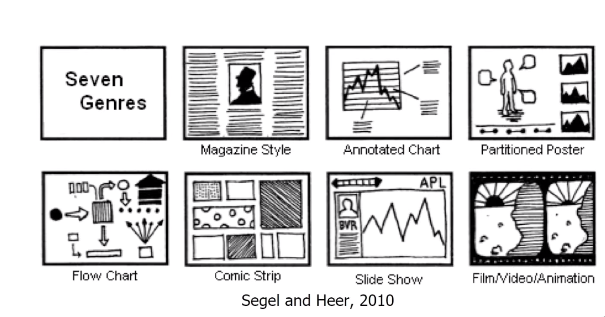
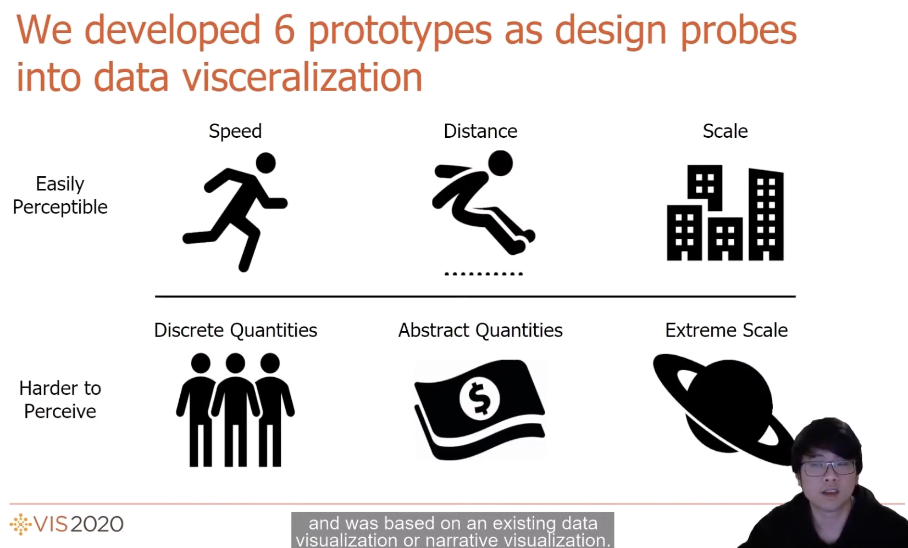
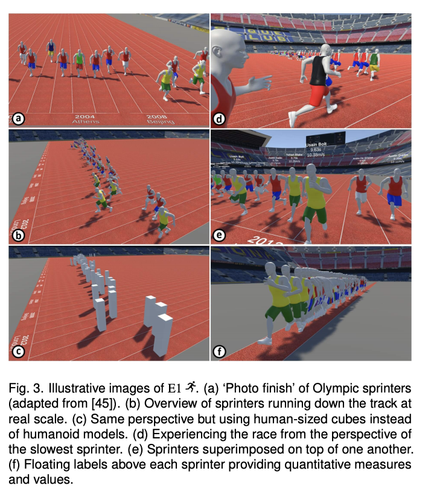
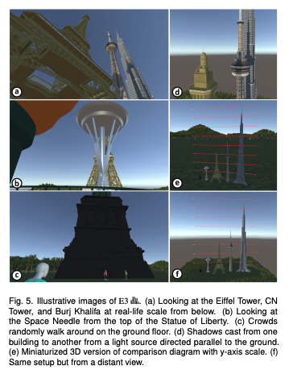
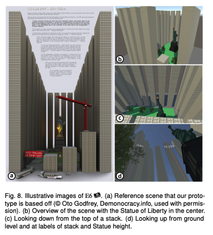
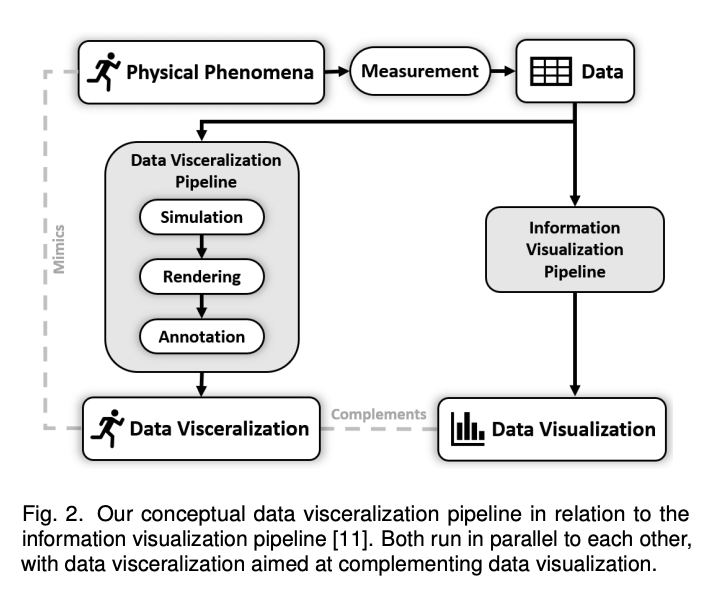

## Data Visceralization: Enabling Deeper Understanding of Data Using Virtual Reality
### Data Structures Fall 2020| S. Molloy reviewing [IEEE talk froom Benjamin Lee and paper from Benjamin Lee, David Brown, Bongshin Lee, Christophe Hurter, Steven Drucker, Tim Dwyer](https://virtual.ieeevis.org/paper_f-info-1084.html "Data Visceralization 2020 IEEE Talk")

This paper was executed as an exploratory study in the theory of data understanding data. Lee, Brown, Lee, Hurter, Drucker and Dwyer (researchers) conducted a mixed methodology study involving high-level metrics which analyzed data comprehension and user feedback to analyze VR prototypes of various narrative data. 

The study was designed to develop data visceralization as a  technique to enable a deeper understanding of scale and physicality. Narrative data models defined in 2010 helped frame the kinds of data that could be explored with data visceralization and the idea of **“Data-driven experiences which evoke visceral feelings within a user to facilitate intuitive understanding of physical measurements and qualities”**.

The aims of this research included assessing and expediting data physicalization and concrete scales (2013) that have been developed to “aid in comprehending unfamiliar units and extreme magnitudes by comparison to more familiar objects” as well as the methods of how to explore data in immersive spaces. In examining the ways in which AR and VR didn’t initially take full advantage of the application of scale as applications kept 2D imagery in 3D environments, Researchers looked at other examples of visceral storytelling to inspire the prototype construction, such as WSJ’s [NASDAQ Rollercoaster (2015)](https://graphics.wsj.com/3d-nasdaq/ "NASDAQ Rollercoaster").

***

The study consisted of quantitative and qualitative feedback on a series of **6 VR prototypes** built with the Unity game engine and explored by participants with the ASUS Windows Mixed Reality Headset (HC102). Insights collected on understanding, user experience and media consumption were limited by the non-randomized size (8 male participants, 4 female) and skew (computer science majors) of the sample, but described useful preferences for desktop/VR for specific data kinds as well as overall UI direction. The study’s 6 prototypes explored distinct data types with real-life examples, including:

- Speed: Men’s olympic 100m
- Distance: Men’s olympic long jump
- Scale: Comparisons of skyscrapers
- Discrete Quantities (of Humans): Hong Kong Protests
- Abstract Measures: US Debt Visualized
- Extreme Scale: Solar System

The study found that the prototypes testing understanding of Speed (E1), Scale (E3), and Abstract Quantities (E5) were the most effective in facilitating the comprehension of the data through emotional responses triggered by the viscerality of the data narrative. These tests, in addition to the analysis of the other data types, provided valuable insight into design approaches.

***

The main insights from this paper were design approaches on perspective, virtuality, realism, annotations, and data transformations. The study showed that there is a **“perceptual sweet spot”** for accurate data scales and that human scale-objects were most effective at quick understanding, though researchers note that “egocentric distance estimations” could potentially lead to warped interpretations. Virtuality and the ability to manipulate the scene proved that **adjusting the viewpoint and scale can enable more thorough comprehension while saving users’ time exploring**. The study proved that **some realism is necessary to provide context** but that it doesn’t need to be high-fidelity and a lack of realism did not affect understanding. Additionally, **annotation  in prototypes did not distract** from understanding in primitive representations even though researchers found that:

>“This was moderately surprising since, as Bertin specifies [7], reading text can capture user attention and thus reduce the perception of other stimuli, negatively impacting the visceral experience with the data.”

Lastly, the **transformation of data and it’s representation can aid in better understanding of data types** such as scale extreme scale. 1:1 scale is the most initially effective, but not always possible, thus requiring the need for relative scales in specific contexts. 

In conclusion, this study finds that data visualizations have a great application to reality based on users’ mental, emotional and physical application to their own lives, and thus work well as a complement to data visualizations. While data visualizations can provide analysis and interpretation, data visceralization can provide a connection to real-world understanding and thus help build mental models for applying that comprehension of data narrative. Future research is aimed at expanding media types studied in data visceralization including augmented reality, haptic stimulation and olfactory devices.
