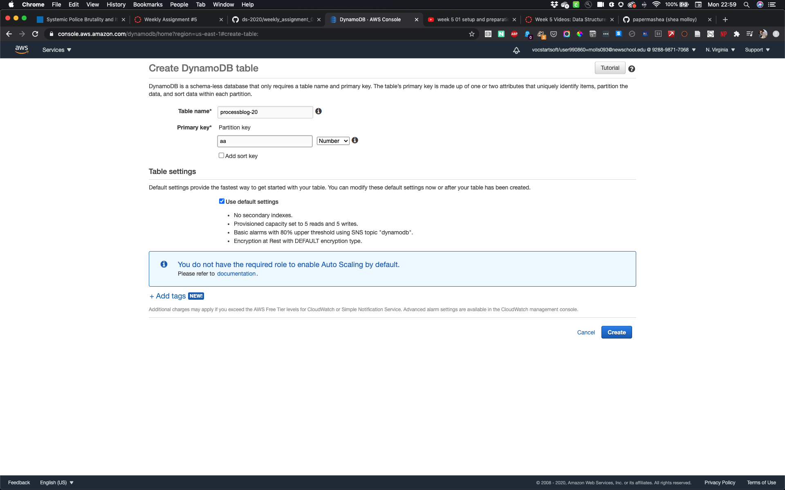
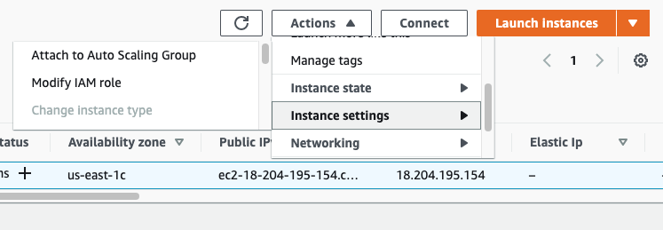
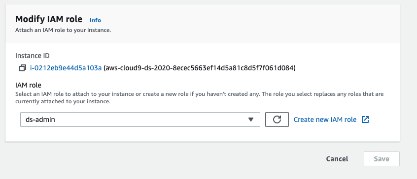
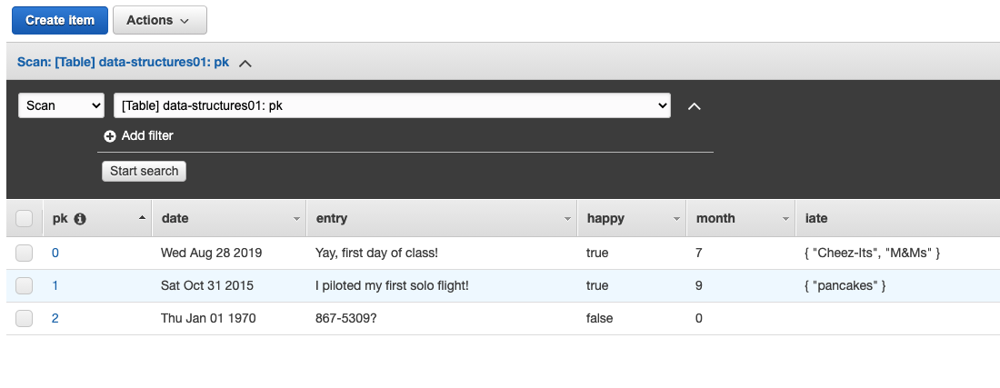
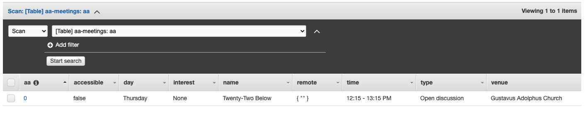

# Week 5: DynamoDB

## Assignment Notes 
Aaron's videos seem to be slightly out of date, based on e2c interface options (i.e. modify iam role vs. attach iam role). This was easy to work around, the more difficult part of the assignment was exploring asyc/await in a forEach loop. I'm working with this write-up:https://codeburst.io/javascript-async-await-with-foreach-b6ba62bbf404?gi=b27bcf2d6bb7

***

## Setup

### Dynamo Creation
I had a difficult time understanding partitioning, but eventually played around enough with defaults and other resources to get the starter code to work. I'm still having errors asking for my partitioning keys, even after switching between 3-4 databases with varying 'aa' or 'pk' keys. 

### Roles from the starter code
Role creation from sample code was easy enough to follow along with, though I ended up making new roles straight from the "Modify IAM" settings: 

### JS Classes
JS classes seem easy enough to understand as they seem to work similarly to CSS classes. I'll be looking into time strings and array options within JS classes, but for this week I updated the starter code to align more with our final project:

    class meeting {
      constructor(primaryKey, name, venue, day, time, type, interest, accessible, remote) {
        this.aa = {};
        this.aa.N = primaryKey.toString(); // .N INDICATES NUMERIC
        // this.aa = {};
        // this.aa.N = primaryKey.toString(); // ATTEMPTED TO SOLVE FOR PARTITIONING ERROR
        this.name = {};
        this.name.S = name;
        this.venue = {};
        this.venue.S = venue;
        this.day = {};
        this.day.S = day;
        this.time = {};
        this.time.S = time;
        // this.date = {}; 
        // this.date.S = new Date(date).toDateString();
        this.type = {};
        this.type.S = type;
        this.interest = {};
        this.interest.S = interest;
        this.accessible = {};
        this.accessible.BOOL = accessible;
        this.remote = {};
        this.remote.BOOL = remote;
        if (remote != null) { // UNINCLUDE A BOOLEAN VALUE FROM THE ITEM
          this.remote = {};
          this.remote.SS = remote; 
        }
      }

***

## Starter code 

### Error from adding item
Parameter values seem to through errors, but I'm not sure what the partitioning keys are that need to be identified in the call. I tried making a new table to get around the error re: partitioning, didn't work. The errors I'm getting look like this:

    { ValidationException: One or more parameter values were invalid: Missing the key pk in the item
    at Request.extractError (/home/ec2-user/node_modules/aws-sdk/lib/protocol/json.js:52:27)
    at Request.callListeners (/home/ec2-user/node_modules/aws-sdk/lib/sequential_executor.js:106:20)
    at Request.emit (/home/ec2-user/node_modules/aws-sdk/lib/sequential_executor.js:78:10)
    at Request.emit (/home/ec2-user/node_modules/aws-sdk/lib/request.js:688:14)
    at Request.transition (/home/ec2-user/node_modules/aws-sdk/lib/request.js:22:10)
    at AcceptorStateMachine.runTo (/home/ec2-user/node_modules/aws-sdk/lib/state_machine.js:14:12)
    at /home/ec2-user/node_modules/aws-sdk/lib/state_machine.js:26:10
    at Request.<anonymous> (/home/ec2-user/node_modules/aws-sdk/lib/request.js:38:9)
    at Request.<anonymous> (/home/ec2-user/node_modules/aws-sdk/lib/request.js:690:12)
    at Request.callListeners (/home/ec2-user/node_modules/aws-sdk/lib/sequential_executor.js:116:18)
      message:
      'One or more parameter values were invalid: Missing the key pk in the item',

I did, however, learn that new tables will default to IAM roles you have previously assigned if you duplicate, etc.

### Success in DB population
I was able to successfully add to the starter db as well as my updated class DB with an aaMeeting array of meeting classes.

***
## Assignment Output

### Adding a loop
While looping should be easy enough, I'm getting a number of errors in params validation when I try to push each aaMeeting in aaMeetings to params.Item as an array and push each item in the array that way. I am able to console.log(params.Item) but will need to apply async/await to populate the DB one at a time.

    var params = {};
    params.Item = [];
    params.TableName = "aa-meetings";
    aaMeetings.forEach(function(aaMeetings){
      params.Item.push(aaMeetings)
    })

    console.log(params.Item)
        [ meeting {
        aa: { N: '1' },
        name: { S: 'Twenty-Two Below' },
        venue: { S: 'Gustavus Adolphus Church' },
        day: { S: 'Thursday' },
        time: { S: '12:15 - 13:15 PM' },
        type: { S: 'Open discussion' },
        interest: { S: 'None' },
        accessible: { BOOL: false },
        remote: { SS: true } },
      meeting {
        aa: { N: '2' },
        name: { S: 'Alive Again' },
        venue: { S: 'Seafarers & Intl House, 2nd floor conference rm' },
        day: { S: 'Saturday' },
        time: { S: '13:00:00 - 14:00 PM' },
        type: { S: 'Step meeting' },
        interest: { S: 'Meditation' },
        accessible: { BOOL: true },
        remote: { BOOL: null } },
     meeting {
        aa: { N: '3' },
        name: { S: 'Agnostics at Noon' },
        venue:
         { S:
            'Lesbian, Gay, Bi-Sexual & Transgender Community Center, 3rd Floor, Room #312' },
        day: { S: 'Thursday' },
        time: { S: '12:00:00 - 13:00 PM' },
        type: { S: 'Closed discussion' },
        interest: { S: 'LGBT, Agnostic' },
        accessible: { BOOL: false },
        remote: { SS: true } } ]

My errors with with pushing params.Item array to db led to me more errors with my params.Item array (27). I found that arrays weren't being read and made them booleans, but am still having trouble validating every field.

Initial error:

    { UnexpectedParameter: Unexpected key 'remote' found in params.Item['2']
     

Digging deeper:
    
    Issues with params validation
    'There were 27 validation errors:\n* UnexpectedParameter: Unexpected key \'aa\' found in params.Item[\'0\']\n* UnexpectedParameter: Unexpected key \'name\' found in params.Item[\'0\']\n* UnexpectedParameter: Unexpected key \'venue\' found in params.Item[\'0\']\n* UnexpectedParameter: Unexpected key \'day\' found in params.Item[\'0\']\n* UnexpectedParameter: Unexpected key \'time\' found in params.Item[\'0\']\n* UnexpectedParameter: Unexpected key \'type\' found in params.Item[\'0\']\n* UnexpectedParameter: Unexpected key \'interest\' found in params.Item[\'0\']\n* UnexpectedParameter: Unexpected key \'accessible\' found in params.Item[\'0\']\n* UnexpectedParameter: Unexpected key \'remote\' found in params.Item[\'0\']\n* UnexpectedParameter: Unexpected key \'aa\' found in params.Item[\'1\']\n* UnexpectedParameter: Unexpected key \'name\' found in params.Item[\'1\']\n* UnexpectedParameter: Unexpected key \'venue\' found in params.Item[\'1\']\n* UnexpectedParameter: Unexpected key \'day\' found in params.Item[\'1\']\n* UnexpectedParameter: Unexpected key \'time\' found in params.Item[\'1\']\n* UnexpectedParameter: Unexpected key \'type\' found in params.Item[\'1\']\n* UnexpectedParameter: Unexpected key \'interest\' found in params.Item[\'1\']\n* UnexpectedParameter: Unexpected key \'accessible\' found in params.Item[\'1\']\n* UnexpectedParameter: Unexpected key \'remote\' found in params.Item[\'1\']\n* UnexpectedParameter: Unexpected key \'aa\' found in params.Item[\'2\']\n* UnexpectedParameter: Unexpected key \'name\' found in params.Item[\'2\']\n* UnexpectedParameter: Unexpected key \'venue\' found in params.Item[\'2\']\n* UnexpectedParameter: Unexpected key \'day\' found in params.Item[\'2\']\n* UnexpectedParameter: Unexpected key \'time\' found in params.Item[\'2\']\n* UnexpectedParameter: Unexpected key \'type\' found in params.Item[\'2\']\n* UnexpectedParameter: Unexpected key \'interest\' found in params.Item[\'2\']\n* UnexpectedParameter: Unexpected key \'accessible\' found in params.Item[\'2\']\n* UnexpectedParameter: Unexpected key \'remote\' found in params.Item[\'2\']',

### Quesions
- What are the partition calls to avoid arrors and what do they mean?
- Will async and await fix my params validation errors?