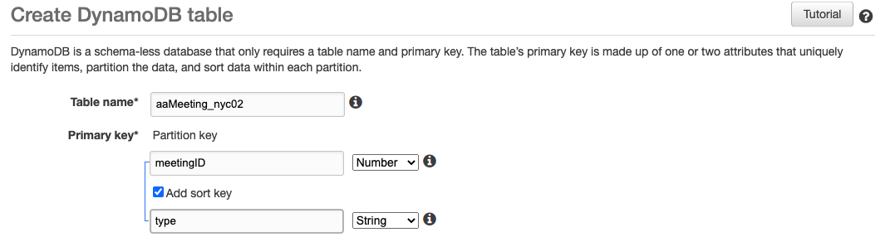

# Week 6: DynamoDB and Queries

## Assignment Notes 

I was getting some validation errors from week05 and while I thought I had figured out primaryKeys more accurately, I still had some work to do with them. I also began the process of breaking out my separate scripts to test. To finalize my async work, I used these resources:
- https://caolan.github.io/async/v3/
- https://dzone.com/articles/how-to-interact-with-a-database-using-the-async-mo

I furthermore read into console.table, which I had both tried to use before installing (lol) and was using incorrectly in previous attempts. I have console.table working in week05b.js with the following script:

    dynamodb.putItem(params, function (err, data) { // PUTITEM ADDS EACH ITEM IN PARAMS TO DB
        if (err) console.log(err, err.stack); // an error occurred
        // else console.table('aaMeetings_NYC');   // PRINT TABLE NAME IF SUCCESSFUL 
        else console.table(data);   // PRINT TABLE IN CONSOLE IF SUCCESSFUL
      });

Though it does show me the following table when called:

    vocstartsoft:~/environment/week06 $ node week06.js
    ┌─────────┐
    │ (index) │
    ├─────────┤
    └─────────┘
    ┌─────────┐
    │ (index) │
    ├─────────┤
    └─────────┘
    ┌─────────┐
    │ (index) │
    ├─────────┤
    └─────────┘
    ┌─────────┐
    │ (index) │
    ├─────────┤
    └─────────┘

I have since been troubleshooting primaryKeys, sortKeys and promise rejections as per this week's assignment, using the following materials:

- https://thecodebarbarian.com/unhandled-promise-rejections-in-node.js.html
- https://aws.amazon.com/blogs/database/using-sort-keys-to-organize-data-in-amazon-dynamodb/ 
- https://stackoverflow.com/questions/33086247/throwing-an-error-in-node-js
- https://docs.aws.amazon.com/amazondynamodb/latest/developerguide/ReservedWords.html

***
## Starter Code

### Items and dynamodb
Revisiting the week04 code helped me assess the structure of my database, keys, item I am creating, and how it relates to querying. I can now consistenyly build new databases with the keys that make sense for my data and add items to that database using async.

### Fake DB querying
I was able to build a placeholder db with the week04 code using the following starter DB:

    // CREATE TABLE WITH LISTED COLUMNS:
    let query = `CREATE TABLE aaInterests (
    address varchar(150),
    lat double precision,
    long double precision,
    day varchar(150),
    interest varchar(200),
    remote varchar(200)
    
### Identifying err
I had a number of errors with client.query and had to rework "if err {throw (err)" to the following script, which I applied throughout the project:

    client.query(query, (err, res) => {
        if (err){ 
            console.log ('error', err.message, err.stack) }
        else {
        console.log(res);
        client.end();
        }
    });

***

## Querying

### Partitioning keys
While I am able to apply sortKeys in a way that makes sense, I am still getting timeout errors when attempting to use these keys, despite applying a setTimeout of 2000 (2s). The errors take a long time to run as they are computationally expensive, and they look like this:

    Unable to query. Error: {
    "message": "Invalid KeyConditionExpression: Syntax error; token: \"<EOF>\", near: \":type\"",
    "code": "ValidationException",
    "time": "2020-10-14T02:35:28.007Z",
    "requestId": "JKDGASIQ7B2GVGLVLLGTKD12B7VV4KQNSO5AEMVJF66Q9ASUAAJG",
    "statusCode": 400,
    "retryable": false,
    "retryDelay": 1.2428857349415012
  
I will revist where to include my meetingID primary key in the query itself. I expect it to click in ~36 hours. I've learned that unhandled promise rejections are what happens when requests aren't totally fulfilled - more specific error parameters will help troubleshoot. 

***
## Assignment Output

## In-depth data
I currently have a fairly limited data set to work with and my key selections are getting closer to my final data structure. I'll need more in-depth data to query deeper and I will need to revisit my data clean up to do this.

### Database keys
My keys seem to be in order and I should be able to finish troubleshooting the queries with the following questions answered -

### Quesions
- Where do you note the primaryKey in the query selections?
- How do you select boolean in query expressions?
- Why are my queries timing out with callbacks set?