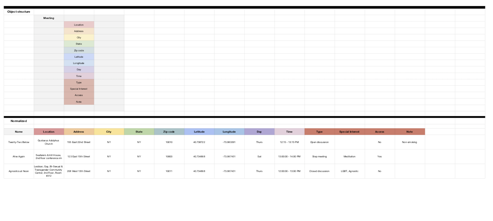

# Week 7: Data Cleanup and Restructuring

## Assignment Notes 

I spent a long time brute forcing ways to scrape the data individually as we had originally practiced in weeks02-03, but am now abstracting my scraping into a series of tider substrings and splices. I also spent a long time troubleshooting why I couldn't push my array into my JSON object before learning that I would have to push to an overall meeting array and reparse as JSON. Some resources I looked at to help me troubleshoot this week include:
- https://stackoverflow.com/questions/26220911/push-array-into-json-object-javascript
- https://cheerio.js.org/
- https://medium.com/@jeanpan/javascript-splice-slice-split-745b1c1c05d2
- https://www.w3schools.com/jsref/jsref_split.asp
- https://stackoverflow.com/questions/2275702/jquery-first-child-of-this
- https://www.w3schools.com/jquery/traversing_find.asp

***
## Data Cleanup

### Individualized scraping
I originally tried to scrape each individual data type from the raw HTML, but the nested elements made it clear that it would be easier to parse the data from a higher-level string based on the 3 "tds" in the meetings structure. I selected 1 random meeting with all the elements I needed for my data model 

And segmented the main arrays by the 3 TDs, one of which I immediately removed.

### Abstracting parsing
After many hours working on trying to keep my individualized arrays tidy, I realized I would have to create substrings for each of my more nested elements, and so I made higher-level arrays for the two kinds of meeting data: Name/Location and Day/Time/Type.

    // IMPORTANT SUBSTRINGS 
    // // REMOVE USELESS INFORMATION
    $('span').empty(); //removing random spans
    $('img').empty(); //removing images + wheelchair text
    $('td[style*="border-bottom:1px solid #dedede; width:90px"]').empty(); //removing 'Get directions' table elements
    // // PULL MEETING NAMES AND LOCATIONS
    $('td[style*="border-bottom:1px solid #e3e3e3; width:260px"]').each(function(i, elem) {
      meetingNL.push( $(elem).text().replace(/(\n|\t|\r)/gm, "").replace(/\s*\(.*?\)\s*/g, '').trim().split(' ')); // NEW ARRAY ITEM AT EVERY LINE BREAK
          // console.log(meetingNL)
    });
    // // PULL MEETING DAYS, TIMES AND TYPES
    $('td[style*="border-bottom:1px solid #e3e3e3;width:350px;"]').each(function(i, elem) {
      meetingDT.push( $(elem).text().replace(/(\n|\t|\r)/gm, "").replace(/\s*\(.*?\)\s*/g, '').trim().split(' ')); // NEW ARRAY ITEM AT EVERY LINE BREAK
          // console.log(meetingDT)
    });

From here, I am finishing up the substrings I will need for my larger array, which will become my JSON object.

***
## Making a Useable Object

### Array vs. object
In my efforts to make my scraping as clean as possible, I attempted to scrape arrays and push them into objects only to receive layered arrays in the object I was trying to create with a loop. 

    // CREATE VENUE ARRAY
    let venueData = [];
    // PULL VENUE DATA FROM H4s
    $('h4[style="margin:0;padding:0;"]').each(function(i, elem) {
      venueData.push( $(elem).text());
        //  console.log(venueData)
    // PUSH VENUE ARRAY TO MEETING OBJECT
    // // CREATES 1331+ OBJECTS IN MEETING
     venueData.forEach(function (i, elem, array) {
         meeting.venue.push(venueData)});
    meeting.venue.push(venueData)
        console.log(meeting) 

I went down a wormhole of lots of different responses to my attempt to push my array to my object:

***
## Assignment Output

## Finalized Cleanup
Working on developing finalized cleanup for database output
