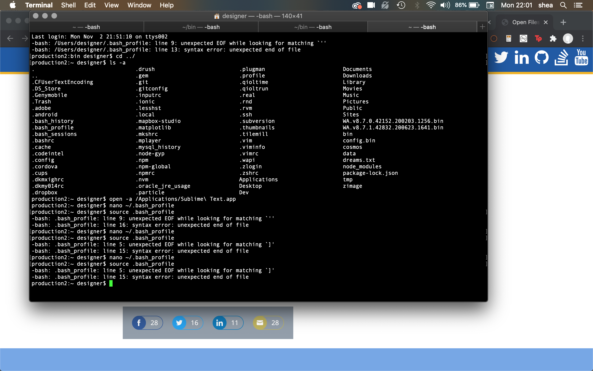

# Week 9: Compiling firmware & Cleaning up data (WIP)

## Assignment Notes 

This week had no assignment, but was important for getting variables set up in particle. I encountered this:

- https://community.particle.io/t/particle-cli-issues/40948/11
- https://docs.particle.io/tutorials/developer-tools/cli/
- https://support.particle.io/hc/en-us/articles/360039251394/
- https://community.particle.io/t/solved-dht22-issue-with-photon/13858

***
## CLI and firmware issues

### USB: no device found
- https://community.particle.io/t/particle-cli-issues/40948/11
- offline and listening mode after updates: https://community.particle.io/t/photon-is-offline-after-it-has-already-been-setup/47547/4

```
 production2:~ designer$ particle usb dfu
TimeoutError [VError]
    at RequestSender.delay (/Users/designer/.particle/node_modules/particle-cli/node_modules/particle-usb/lib/device.js:106:13)
    at /Users/designer/.particle/node_modules/particle-cli/node_modules/particle-usb/lib/device.js:212:17
    at async Promise.all (index 0)
    at async CLI.runCommand (/Users/designer/.particle/node_modules/particle-cli/dist/app/cli.js:160:7)
    at async CLI.run (/Users/designer/.particle/node_modules/particle-cli/dist/app/cli.js:190:14) {
  jse_shortmsg: '',
  jse_info: {},
  message: ''
    }
```

### Reinstalling CLI
Upon rebooting my particle proton device, I found I was no longer able to access the device via usb with command line interface tools. I ended up trying a lot of work arounds including uninstalling and reinstalling particle cli a few times with npm:

    npm uninstall -g particle-cli
    bash <( curl -sL https://particle.io/install-cli )


### .bash, brew and dfu
Eventually I tried several different usb cables, updating cli, updating dfu-util, updating my local bash profile and settings, and using a different computer to update the device firmware and was able to interact with the device again.

More on installing dfu: https://support.particle.io/hc/en-us/articles/360039251394/



```
    alias drush="/usr/local/bin/drush"

    export NVM_DIR="/Users/designer/.nvm"
    [ -s "$NVM_DIR/nvm.sh" ] && . "$NVM_DIR/nvm.sh"  # This loads nvm
    export PATH=$PATH:/Users/designer/Dev/android

    [[ -s "$HOME/.rvm/scripts/rvm" ]] && source "$HOME/.rvm/scripts/rvm" # Load RVM into a shell session *as a function*

    if [ -d "$HOME/bin" ] ; then
        PATH="$HOME/bin:$PATH"
    fi

    alias sublime="open -a /Applications/Sublime\ Text.app"
```


```
    For more information, visit our documentation at https://docs.particle.io

    Get started by running "particle login"
    If that doesn't work, open a new terminal and make sure /Users/designer/bin is in your shell path.
    If you previously installed the CLI with npm, run "npm uninstall -g particle-cli"
    production2:~ designer$ particle --version
    2.8.1
```


***
## Updates

## Working device
Working device is currently recording temperature, humidity, dew point and heat index. The temperature variable is accessible in Farhenheit. 

## Sketches 
Sketches from last week have been updated here: https://xd.adobe.com/view/cdf8d3dd-c801-4024-b4ae-61fb620d9b40-98ab/

## Future sensor data (from Adafruit Sensor pack 900):
- Pressure: Round Force-Sensitive Resistor (FSR) - Interlink 402 https://www.adafruit.com/product/166
- Light: Photo cell (CdS photoresistor) https://www.adafruit.com/product/161
- Orientation: Tilt ball switch https://www.adafruit.com/product/173


## Questions
- What else can I pull in to examine the environment?
- Is Dew point/Humidity/Heat index being converted to Celcius?
- How often should I run these data pulls?