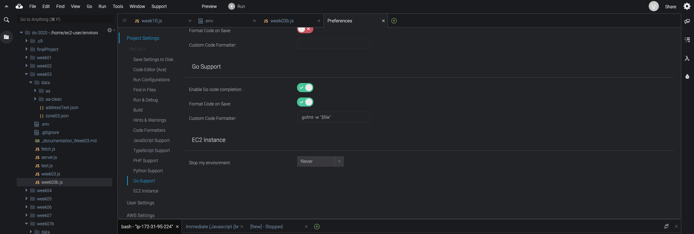

# Week 10: Serverless Computing

## Assignment Notes 

This week's assignment was primarily in configuring the storage of our sensor into an AWS database. While I ran into a lot of setup errors in creating the database, it ended up being good practice for future AWS work.

***
## Table creation

### Postgres vs DynamoDB
I went with the SQL table creation to better practice SQL queries as I believe this database will be less "free form" than would benefit a Dynamo DB instance. As there will be one record with most, if not all, columns filled, SQL seemed the most straightforward decision.

### Postgres method
Creating my table took longer than expected and my initial queries timed out with an Unhandled promise rejection. I was thrown this error:

```
 node:4920) UnhandledPromiseRejectionWarning: Error: connect ETIMEDOUT 172.31.24.157:5432
    at TCPConnectWrap.afterConnect [as oncomplete] (net.js:1107:14)
(node:4920) UnhandledPromiseRejectionWarning: Unhandled promise rejection. This error originated either by throwing inside of an async function without a catch block, or by rejecting a promise which was not handled with .catch(). (rejection id: 1)
(node:4920) [DEP0018] DeprecationWarning: Unhandled promise rejections are deprecated. In the future, promise rejections that are not handled will terminate the Node.js process with a non-zero exit code.
Error: Connection terminated unexpectedly
    at Connection.con.once (/home/ec2-user/node_modules/pg/lib/client.js:132:73)
    at Object.onceWrapper (events.js:286:20)
    at Connection.emit (events.js:198:13)
    at Socket.<anonymous> (/home/ec2-user/node_modules/pg/lib/connection.js:58:12)
    at Socket.emit (events.js:198:13)
    at TCP._handle.close (net.js:607:12) undefined
```

### Inspecting RDS
When I logged into my RDS dashboard to look at my database details to troubleshoot, I found that there were no databases existing in my account. I'm not sure why this is, but it could be from working on my cleanup data earlier. I followed the steps from week04 to make a new database: https://github.com/samizdatco/ds-2020/blob/master/weekly_assignment_04.md


### Rules
Wow I literally don't even remember setting rules in my first database so I guess it's good I'm doing this again.

### Errors
Password error was just not referencing my dotenv correctly (no quotes)
```
(node:10132) UnhandledPromiseRejectionWarning: error: password authentication failed for user "shea"
```

Database name error was confusing, apparently I named it 'aa' to align with past work but my credentials claimed that my db was named data-structures. Fixed by using 'aa'.

```
(node:10523) UnhandledPromiseRejectionWarning: error: database "data-structures" does not exist
```

Eventually I was able to create a new table in my aa database in my postgres instance in AWS.

### Settings
Setting up the IDE instance to always run was easy enough once I realized how different my environment looked compared to the starter videos:


***
## Adding device data

### Debugging errors: undefined variable
Using "export" to read my proton variables, I ran node to test my query statements. 

    export PHOTON_ID='actualProtonID'
    export PHOTON_TOKEN='actualProtonToken'

Running *node worker.js* took a long time to process (probably longer than a minute), so I made sure to update my setInterval to 60000 the next time around. In my initial INSERT statement, I recieved the following error:

    INSERT INTO sensorData VALUES (undefined, DEFAULT);
    { error: column "undefined" does not exist
        at Parser.parseErrorMessage (/home/ec2-user/node_modules/pg/node_modules/pg-protocol/dist/parser.js:278:15)
        at Parser.handlePacket (/home/ec2-user/node_modules/pg/node_modules/pg-protocol/dist/parser.js:126:29)
        at Parser.parse (/home/ec2-user/node_modules/pg/node_modules/pg-protocol/dist/parser.js:39:38)
        at Socket.stream.on (/home/ec2-user/node_modules/pg/node_modules/pg-protocol/dist/index.js:10:42)
        at Socket.emit (events.js:198:13)
        at addChunk (_stream_readable.js:288:12)
        at readableAddChunk (_stream_readable.js:269:11)
        at Socket.Readable.push (_stream_readable.js:224:10)
        at TCP.onStreamRead [as onread] (internal/stream_base_commons.js:94:17)
      length: 109,
      name: 'error',
      severity: 'ERROR',
      code: '42703',
      detail: undefined,
      hint: undefined,
      position: '32',
      internalPosition: undefined,
      internalQuery: undefined,
      where: undefined,
      schema: undefined,
      table: undefined,
      column: undefined,
      dataType: undefined,
      constraint: undefined,
      file: 'parse_relation.c',
      line: '3359',
      routine: 'errorMissingColumn' } undefined

To fix this, I tried renaming my variables in the INSERT statement as they were reading undefined. I renamed the variable "tv", since I plan on adding more sensor data anyway, "sv" seemed too generic. 

### Debugging errors: password
I got another error claiming my password for my database user "shea" no longer worked:

    INSERT INTO sensorData VALUES (undefined, DEFAULT);
    (node:17458) UnhandledPromiseRejectionWarning: error: password authentication failed for user "shea"

This didn't make a lot sense as I had just used it to create the table. I had, however, stored other potentially useful, sensitive information in there (api url, etc.) so I tried renaming those in my dotenv file incase they were conflicting with one another. I double-checking commas, etc. in my dotenv file but recieved the same error. I then tried rewriting the credentials code to use the AWS endpoint as a dotenv variable instead of the URL as per the first step:

    var db_credentials = new Object();
    db_credentials.user = 'shea';
    db_credentials.host = process.env.AWSRDS_EP; // AWS environment in dotenv

At least I'm getting a different error now:

    INSERT INTO sensorData VALUES (undefined, DEFAULT);
    (node:18688) UnhandledPromiseRejectionWarning: Error: connect ECONNREFUSED 127.0.0.1:5432

I tried moving my dotenv variables to my ecosystem.config.js file, along with the development environment configuration as per the starter code:
    
    NODE_ENV: 'development', 

I realized the config file would only be called when PM2 was activated, so I re-exported my *PHOTON_ID* and *PHOTON_TOKEN* just in case. I recieved this error:

    INSERT INTO sensorData VALUES (76.27999877929688);
    (node:21780) UnhandledPromiseRejectionWarning: Error: connect ECONNREFUSED 127.0.0.1:5432
        at TCPConnectWrap.afterConnect [as oncomplete] (net.js:1107:14)


### Debugging errors: connection refused
Upon re-watching the videos, I realized that my particle_variable was still set to 'analogue'

***
## Assignment Output

### Postgres Database
After some investigation, I was able to create a table in a postgres database to be queried later in the project. 

### Device data
As I'm still debugging my insert statement and database pushing, I'm waiting to see data.

### PM2 for management
As I'm still debugging my insert statement and database pushing, I'm waiting to see run *pm2 start ecosystem.config.js*.

## Questions
- Why was my database deleted?
- Why am I so low on credits?
- How will I get more credits?
- Why am I getting so many errors with my database access?