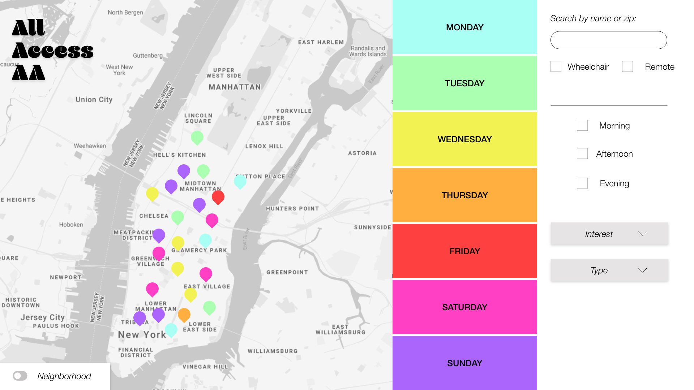
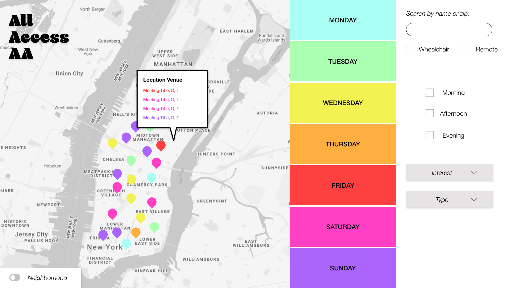
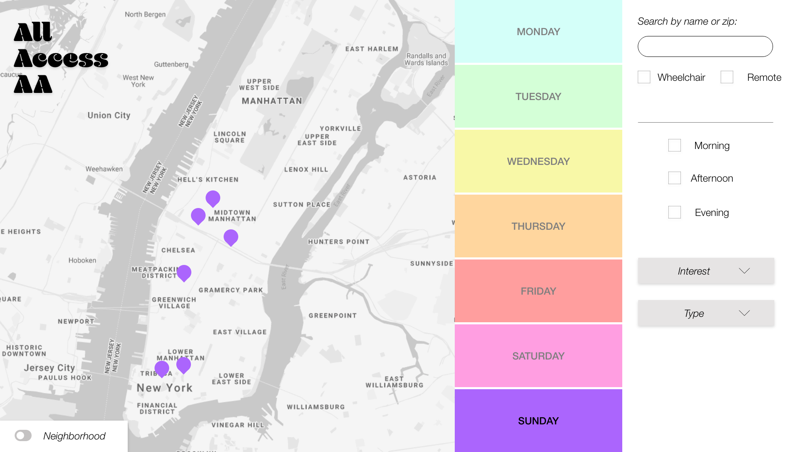
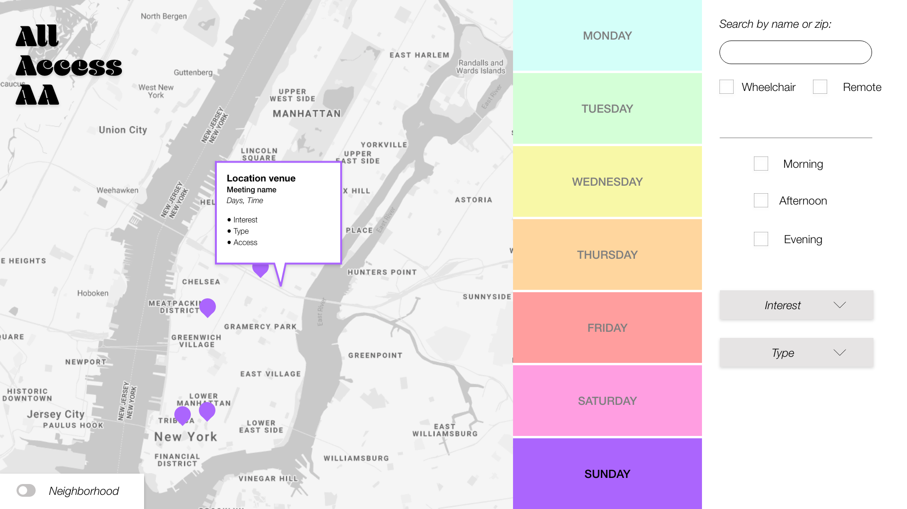
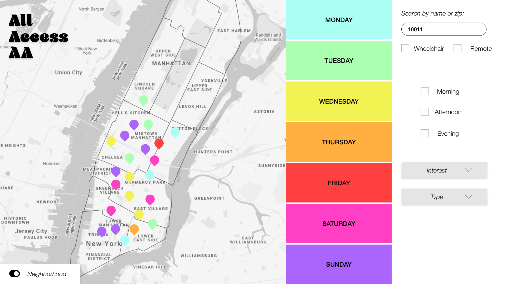
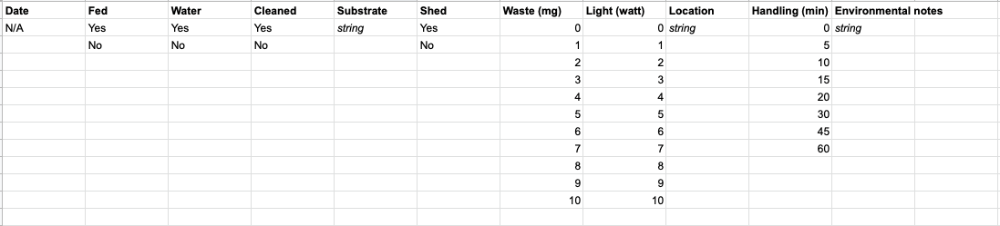
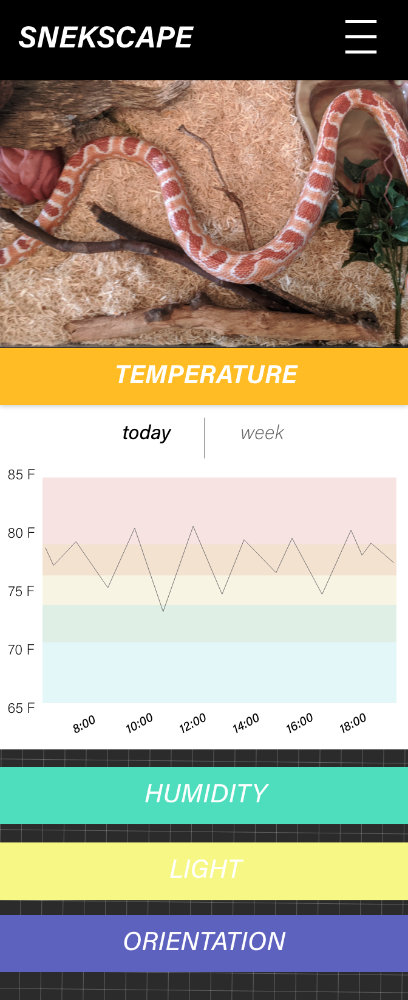
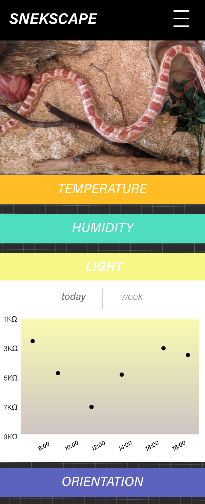
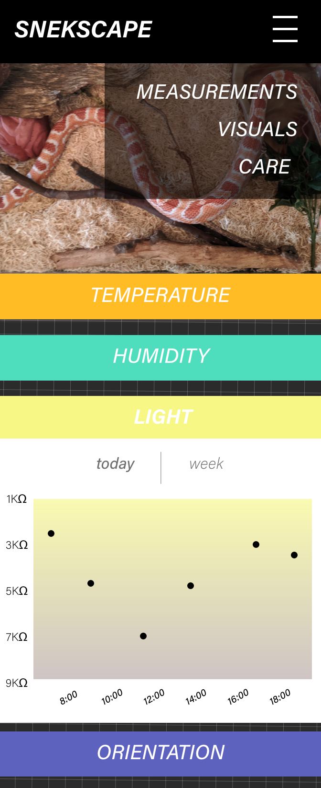
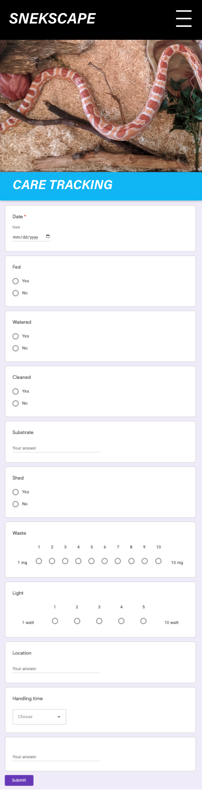

# Week 11: Design Mode

***
## Assignment 1: AA Meetings

### UI for data
Users will likely be looking for a meeting that fits their schedule and interests above all else. I've prioritzed days of the week and organized the times by ranges to reflect user availability. This design will be as interactive as possible but will mostly focus on versaility of the data and drilling into it. My understanding of these users is that they will likely know a day/location that works best for them first, and will need to narrow down by the other after drilling in to one.

### Designs
These designs are meant to elevate inclusivity and access to AA members of all interests. Users can drill filter with a variety of methods but are only shown the relevant information to attending the meetings in the information bubble. I've also accounted for some users who are looking for specific interest groups, types of meetings, or access levels.

**Decisions & Questions:**
- Do zones actually add anything to the interface?
- How often are users looking for specific meeting information?
- Can remote locations be joined?
- How many meetings will overlap in one location?

### Data tasks to be done
The remaining data scraping tasks include data cleanup QA and to add information for "remote" meeting data to the interface and to scrape that data into the page from these resources:
- https://www.nyintergroup.org/remote-meetings/
- https://www.aa.org/pages/en_US/options-for-meeting-online

The remaining data organizing tasks include querying by day correctly, building out the zone overlay (if necessary) and grouping the times by morning/afternoon/evening. I will also need to determine if the search bar is particularly important or if types/interests/access should take priority. 

**Ongoing designs will be kept here: https://xd.adobe.com/view/da09c604-b579-44a5-88f6-ace1e85d01e2-8f5a/**

***
## Assignment 2: Process Blog

### Managing mixed data
As my life is not very interesting, I decided to incorporate my daily process blog thinking into my IoT designs, which examine environmental factors in my pet snake's tank. I am keeping track of Plissken's (snake) feeding, shedding, handling, watering, substrate replacement, waste, location, lighting and more to gain better insight into his behaviors according to my interactions with him. While this largely collects as booleans, there are also strings and ranges for time handled and weight waste, which will be converted to ranges.

The user could be any caregiver looking to spot care caps or creature needs. Flagging statuses would be the most helpful, but this could also be intuitive knowledge applied by the user to the high-level analysis.

### Designs
My designs for this daily data prioritize pattern analysis and ranges for keeping Plissken healthy. I'm keeping track of the data over the course of a month and looking at gaps in his care based on ranges determined by pet experts. I've made a form to track this data over time, and will be incorporating the form entry into my IoT designs as well: https://forms.gle/VPTqtNTsYF3Mh5nc9

**Decisions & Questions:**
- Do the circles make sense for qualitative and quantitative data?
- What sources can I cite for healthy care data?
- Are statuses feasible?

### Data tasks to be done
To build out this data, I will need to import my existing data into my form data, pull that into a data set, and create ranges to query for the statuses. I will need to map collected data to a new database and push it to AWS to query. I've outlined the ranges for data input and analysis here: 

**Ongoing designs will be kept here: https://xd.adobe.com/view/c2543b4c-be77-452d-a904-3e9875ce7b5e-9707/**

***
## Assignment 3: Internet of things

### Interactive IoT
My IoT interface will be displaying the active environmental measurements for tempurature, humidity, light, pressure, and orientation of Plissken's tank. I've started incorporating the light and orientation sensors, and am deciding where to put the pressure sensor to best determine his placement in the environment without interfering with his substrate. 

### Designs
This interface will be interactive in that different visualizations will be able to be shown at different times, and there will be menu items for different pages of information.

**Decisions & Questions:**
- How easy will it be to manipulate the data collected from the Photon?
- What language will I use to visualize the data?
- Can I embed google forms to collect care data?

### Data tasks to be done
I'm currently implementing the photon, pressure and orientation sensors to pull data into the Particle web interface. From there, I will need to build a web interface and display the data. I also hope to pull in a live stream using an old phone, and to embed my care tracking form to collect ongoing data for the process blog assignment. 

**Ongoing designs will be kept here: https://xd.adobe.com/view/16ed4ef3-a068-4a18-8cb9-79a840361ad4-43be/**
